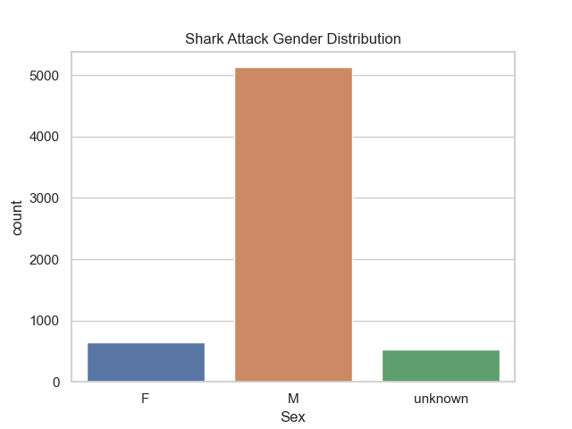
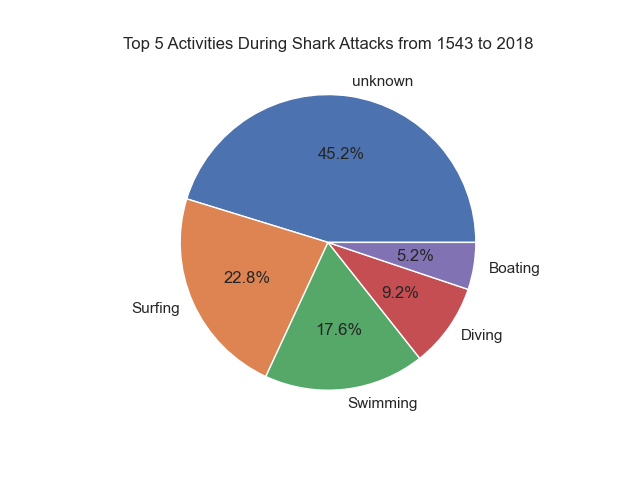
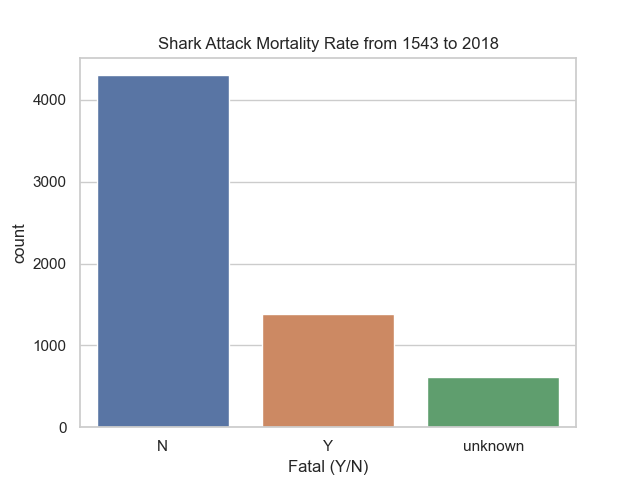
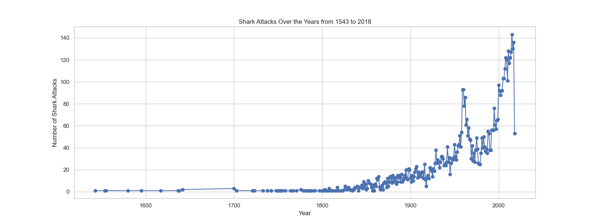
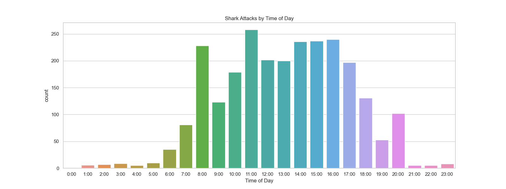
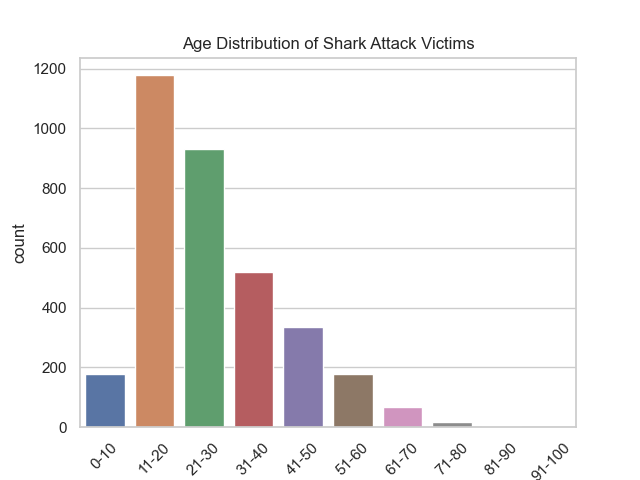
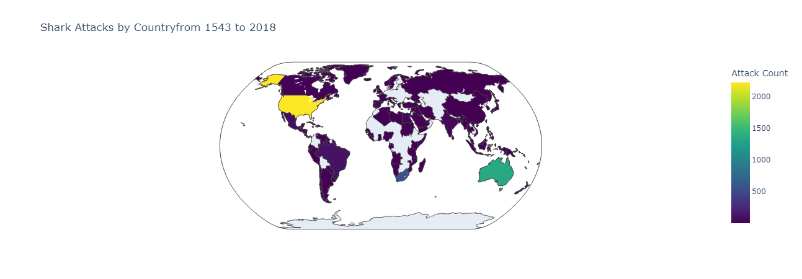

# Shark Attack Data Analysis
This repository contains Python code for analyzing a dataset related to shark attacks. The dataset was extracted and cleaned, and various plots were created to answer specific questions about shark attacks. This README file provides an overview of the analysis and the questions addressed.

## Table of Contents

1. [Overview](#overview)
2. [The repo](#directory-structure)
2. [Dataset](#dataset)
3. [Questions and Analysis](#questions-and-analysis)
    - [Question 1: Are sharks gender discriminative?](#question-1-are-sharks-gender-discriminative)
    - [Question 2: What percentage of the attacks occur when doing activities like boat trips, fishing, surfing...?](#question-2-what-percentage-of-the-attacks-occur-when-doing-activities-like-boat-trips-fishing-surfing)
    - [Question 3: What's the mortality rate of a shark attack?](#question-3-whats-the-mortality-rate-of-a-shark-attack)
    - [Question 4: Do they increase or decrease along the years?](#question-4-do-they-increase-or-decrease-along-the-years)
    - [Question 5: What time of the day do more attacks occur?](#question-5-what-time-of-the-day-do-more-attacks-occur)
    - [Question 6: What range of age is the most attacked?](#question-6-what-range-of-age-is-the-most-attacked)
    - [Question 7: What are the most affected countries?](#question-7-what-are-the-most-affected-countries)
5. [Key Findings](#key-findings)
    - [1. Demographics of Victims](#1-demographics-of-victims)
    - [2. Activities during Attacks](#2-activities-during-attacks)
    - [3. Mortality Rate](#3-mortality-rate)
    - [4. Historical Trends](#4-historical-trends)
    - [5. Geographical Distribution](#5-geographical-distribution)
6. [Conclusion](#1-conclusion)
7. [Links](#links)

## Overview
In this exercise, a dataset related to [worldwide shark attacks](https://www.kaggle.com/datasets/teajay/global-shark-attacks/discussion) was used for analysis. The data was cleaned and processed to extract useful insights. Various questions about shark attacks were addressed using data visualization techniques.

## Directory Structure

The repository is organized with the following directory structure:

- `/data`: This directory contains the dataset used for the analysis.
- `/images`: This directory stores the figures and plots generated during the analysis.
- `/src`: This directory contains the source code and Jupyter notebooks used for the analysis.
  - `hipotesis-exploration-notebook.ipynb`: Jupyter notebook for hypothesis exploration.
  - `cleaning-notebook.ipynb`: Jupyter notebook for data cleaning and preprocessing.
  - `visualization.ipynb`: Jupyter notebook for data visualization.
  - `main.py`: The main Python script for running the analysis. (**Under construction...** Could not automatize the cleaning and vizualization proces, lack of time)

## Dataset
This analysis focuses on a dataset of shark attacks, aiming to gain insights into the patterns and trends surrounding shark attacks. The dataset spans from the year 1543 to 2018 and provides valuable information about the victims, activities at the time of the attacks, mortality rates, time of day, geographical locations and more...

## Questions and Analysis
### Question 1: Are sharks gender discriminative?
To answer this question, a countplot was created to visualize the distribution of shark attacks by gender. The analysis provides insights into whether shark attacks show a gender bias. Of course they don't... But this could mean that men provoke more shark attacks than women

### Question 2: What percentage of the attacks occur when doing activities like boat trips, fishing, surfing...?
A pie chart was generated to show the distribution of the top 5 activities during shark attacks. This analysis provides information about the most common activities associated with shark attacks.

### Question 3: What's the mortality rate of a shark attack?
A countplot was used to visualize the mortality rate of shark attacks. This analysis provides information about the proportion of fatal and non-fatal shark attacks.

### Question 4: Do they increase or decrease along the years?
A line plot was created to show the trend of shark attacks over the years. This analysis provides insights into whether shark attack reports are increasing or decreasing with time.

### Question 5: What time of the day do more attacks occur?
A countplot was used to show the distribution of shark attacks by the time of day. This analysis provides information about the times when shark attacks are more likely to occur.

### Question 6: What range of age is the most attacked?
A countplot was created to visualize the age distribution of shark attack victims. The data is divided into age ranges to identify the most vulnerable age groups.

### Question 7: What are the most affected countries?
To answer this question, a map plot was created to visualize the distribution of shark attacks by country. This analysis provides insights into which countries have experienced the most shark attacks. In the `visualization.ipynb` file on source folder there's an interactive map at the end made with `plotly.express` package

## Key Findings

### 1. Demographics of Victims
   - **Mostly Men Suffer from Shark Attacks:** The data shows that the majority of shark attack victims are males. This suggests that men are more prone to shark encounters than women.

   - **Age of Victims:** The age group most commonly affected by shark attacks falls within the range of 11 to 30 years old. This demographic appears to be more at risk compared to other age groups.

### 2. Activities during Attacks
   - **Surfing and Swimming Activities:** The dataset reveals that most shark attacks occur during surfing and swimming activities. This finding indicates that these water-based activities are associated with a higher risk of shark encounters.

   - **Time of Day:** The majority of reported attacks happen between 8:00 am and 5:00 pm. This could be due to the increased presence of people in the water during daylight hours, making encounters more likely.

### 3. Mortality Rate
   - **Low Mortality Rate:** Despite the fear and sensationalism surrounding shark attacks, the dataset indicates that the mortality rate for these incidents is relatively low. This suggests that while shark attacks can be traumatic and life-threatening, they do not often result in fatalities.

### 4. Historical Trends
   - **Increase in Shark Attacks:** Shark attacks have increased significantly over the years, with a notable surge between 1900 and 2000. This rise may be attributed to advancements in technology and improved data collection methods. It's important to note that the increase in reported attacks does not necessarily mean that the actual number of shark attacks has increased but rather the number of reported incidents.

### 5. Geographical Distribution
   - **Countries with the Most Reported Shark Attacks:** According to the dataset, the top three countries with the highest number of reported shark attacks from 1543 to 2018 are the USA, Australia, and South Africa, in descending order. This suggests that these countries are more prone to shark encounters, which could be influenced by their coastal geography and popular water-based activities.

## Conclusion
In conclusion, the analysis of the shark attacks dataset reveals that shark attacks predominantly affect males, with surfing and swimming being the most common activities at the time of the attacks. Despite the fear surrounding shark encounters, the mortality rate is relatively low. The increase in reported attacks over the years can be attributed to advancements in technology and data collection. Finally, the geographical distribution of attacks highlights that the USA, Australia, and South Africa have experienced the highest number of reported shark attacks. Understanding these patterns and trends can help in the development of strategies for shark attack prevention and mitigation in high-risk areas.

## Links
[Link to the presentation ](https://www.canva.com/design/DAFyHXYu29w/IWmQt43FoKd39QzxxvzV5A/edit?utm_content=DAFyHXYu29w&utm_campaign=designshare&utm_medium=link2&utm_source=sharebutton)
[worldwide shark attacks dataset](https://www.kaggle.com/datasets/teajay/global-shark-attacks/discussion)

## P.S.
The Python code used to generate these visualizations and analyze the data can be found in the Jupyter Notebook or Python script associated with this repository.